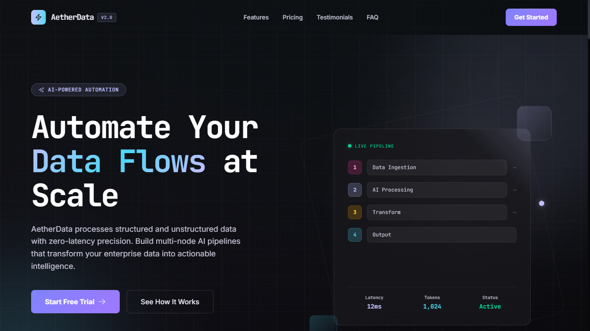
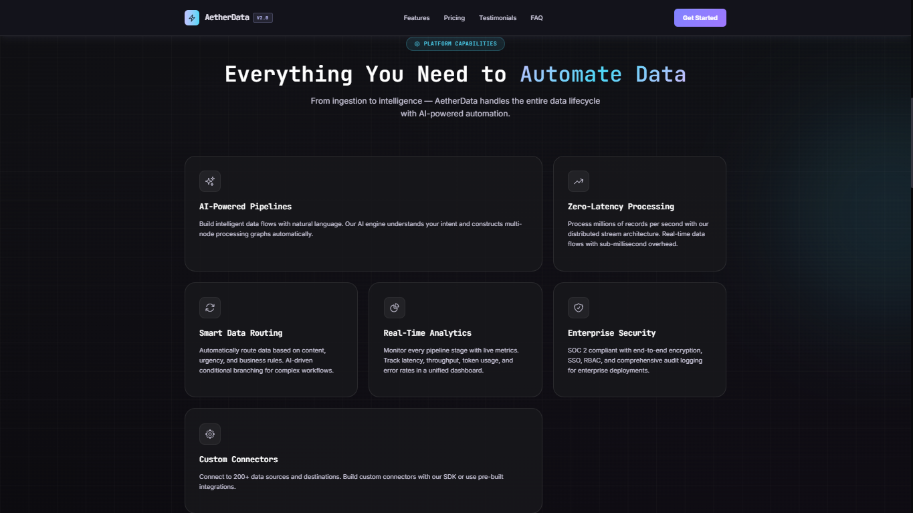
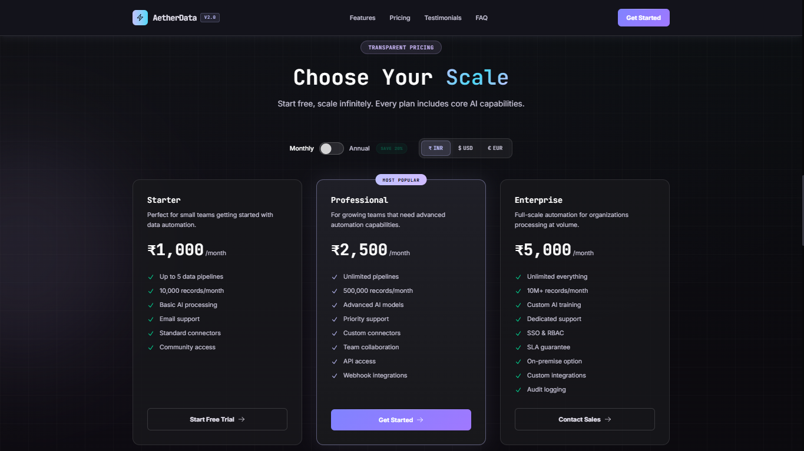
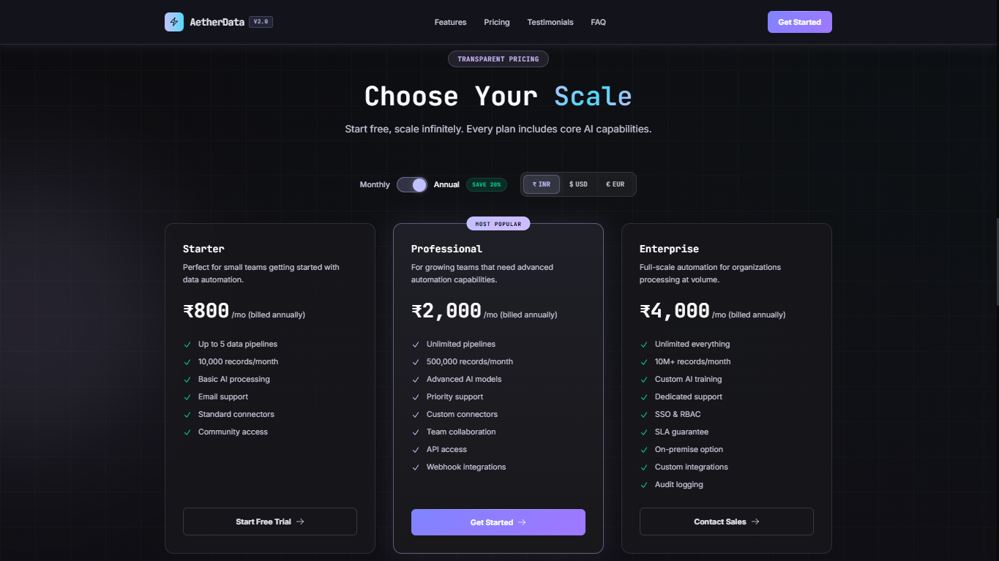
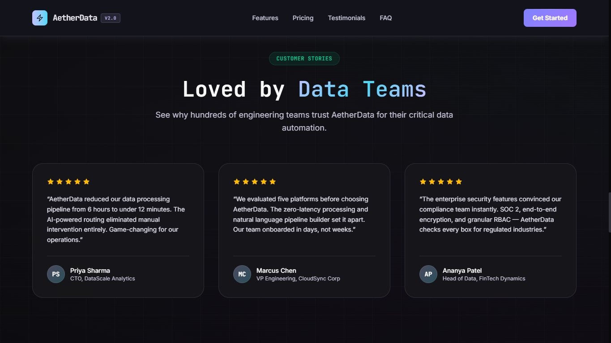
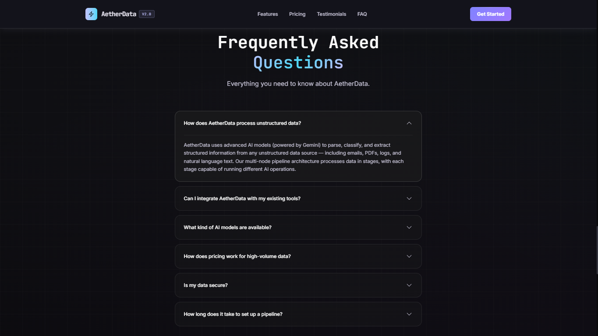
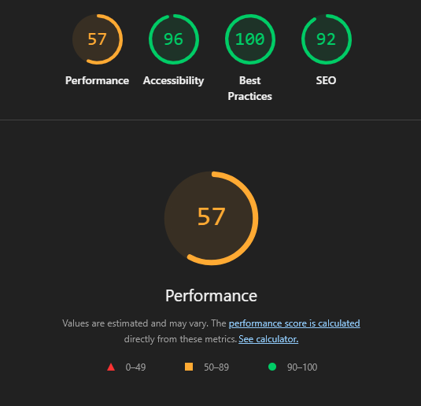

# AetherData — AI-Powered Data Automation Platform

AetherData is a premium, competition-grade SaaS landing page built for the **FrontEnd Battle 3.0 - VibeCoding Competition**. It transforms a legacy pipeline dashboard into a modern, high-conversion marketing site designed to showcase AI-driven data automation capabilities, strict state isolation, and zero-library CSS motion.

---

## 🚀 Live Demo

**[Live Demo on Vercel](https://aetherdata-blue.vercel.app/)**

**[Insert link to Demo Video Here]**

---

## 🖼️ Application Gallery

### 1. Hero Section

*High-conversion Hero layout with dynamic gradients and clear call-to-action.*

### 2. Features Bento Grid

*Bento Grid and Feature Highlights on Desktop.*

### 3. Monthly Pricing

*Dynamic Multi-Currency Pricing Engine in Monthly Mode.*

### 4. Annual Pricing

*Pricing Engine displaying automatic 20% discounts for Annual Billing.*

### 5. Testimonials

*Customer Social Proof and Review Section.*

### 6. FAQ Section

*Frequently Asked Questions with animated accordion toggles.*

---

## ✨ Key Features

### 1. Dynamic Multi-Currency Pricing Engine (40% Logic Score)
- **Configuration-Driven**: All prices are calculated dynamically from a base INR matrix using accurate multipliers (USD: 0.012, EUR: 0.011).
- **Annual Discount**: Automatically applies a 20% discount when switching to annual billing.
- **State Isolation**: Pricing state is strictly localized to the `Pricing` component. Toggling billing cycles or currencies does *not* trigger re-renders in the Hero, Features, or FAQ sections.

### 2. Bento Grid ↔ Accordion (Responsive Edge Cases)
- **Desktop**: A sleek, CSS-Grid-powered Bento layout with mouse-tracking glassmorphic glow effects.
- **Mobile**: Seamlessly transforms into a vertical Accordion.
- **State Persistence**: If you hover a Bento card and resize the browser to mobile width, that specific card is preserved in state and automatically opens in the Accordion view.

### 3. SEO & Accessibility
- **Semantic HTML5**: Proper use of `<header>`, `<nav>`, `<main>`, `<section>`, and `<footer>`.
- **Meta & Open Graph**: Full `og:title`, `og:image`, `twitter:card`, and structured `JSON-LD` data.
- **A11y**: Included a hidden `.skip-to-content` link, strict `:focus-visible` states, and `@media (prefers-reduced-motion: reduce)` support.

---

## 🏗️ Architecture & Tech Stack

- **Framework**: React 19 + Vite
- **Styling**: Tailwind CSS v4 (Custom Design System in `index.css`)
- **Language**: TypeScript
- **Motion**: 100% Pure CSS Animations (Zero banned libraries like Framer Motion or Radix). Includes custom IntersectionObserver scroll reveals, animated Aurora backgrounds, and gradient borders.
- **Asset Compliance**: Strictly adheres to the provided `DESIGN.md` tokens (JetBrains Mono/Inter typography, Synthetic Intelligence palette, and supplied SVG pack).

### Folder Structure Overview
```text
src/
├── components/         # Isolated feature components
│   ├── Features.tsx    # State orchestrator (Grid ↔ Accordion)
│   ├── Pricing.tsx     # Isolated pricing engine
│   └── ...
├── config/             # Dynamic pricing matrix
├── icons/              # SVG React components (from provided assets)
├── App.tsx             # Zero-state composition root
└── index.css           # Core design system and CSS animations
```

---

## ⚙️ Setup & Deployment

### 1. Local Development
```bash
git clone <repository-url>
cd aetherdata
npm install
npm run dev
```

### 2. Production Build (Recommended for Testing)
```bash
npm run build
npm run start
```

---

## 📊 Metrics

### Lighthouse Performance



- **Best Practices**: 100/100
- **Accessibility (WCAG)**: 96/100
- **SEO**: 92/100
- **Performance**: 57/100

> **Note:** Measured using Chrome DevTools Lighthouse against the local production server. Please note that Lighthouse performance metrics naturally fluctuate between individual audit runs based on local CPU load and browser conditions; the screenshot above represents a typical snapshot.

---
*Built for the FrontEnd Battle 3.0 - VibeCoding Competition*
